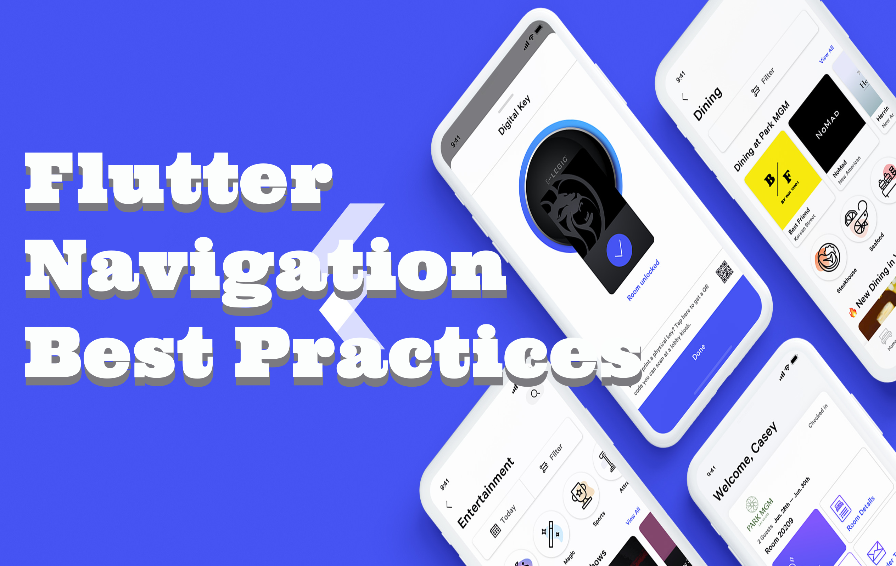

# Flutter Nav Best Practices

Flutter Navigation Best Practices including adapting navigation to platform and branding techniques for navigation surfaces.

## Articles

[FlutterUX Best Practices, It's Not Rail Navigation](https://itnext.io/flutter-ux-best-practices-its-not-rail-navigation-86894562a27b)

[Flutter Adaptive Nav Best Practices, Shaped Drawers](https://medium.com/p/flutter-adaptive-nav-best-practices-shaped-drawers-f4e8d394029)

[Branding Appbars](https://medium.com/p/branding-appbars-6bcf230ccad0)

[Do A Flutter UX Branding Rail Navigation Experiment](https://medium.com/p/do-a-flutter-ux-branding-rail-navigation-experiment-a019b410bfe0)